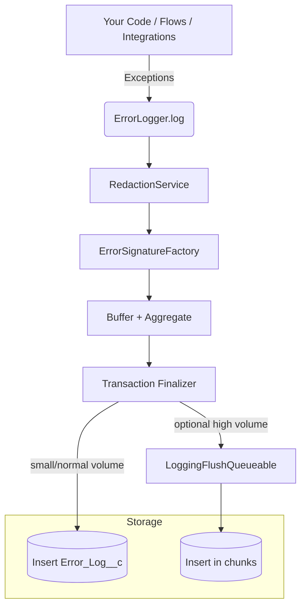

# Architecture

- Sensitive data is scrubbed before persistence.
- Duplicate suppression groups same errors within a short window using a stable signature.
- Finalizer persists records post-commit; queueable is available for high-volume scenarios.
